# City Simulation

This simulation generates realistic urban density patterns on a grid-based city model.

## Core Components

### Spatial Structure

The simulation uses a grid-based spatial model:

- **[Block](block.py)**: The fundamental unit representing a city block with population, housing units, commercial uses, and zoning
- **[Grid](grid.py)**: A container holding all blocks in a 2D coordinate system

### Density Generation

The simulation creates realistic urban density patterns using a **polycentric model**:

- **[CityCenters](city_centers.py)**: Generates density using multiple activity centers where density decays exponentially with distance
- Centers can be distributed uniformly (evenly spaced), clustered (grouped together), or randomly
- Each center contributes to nearby blocks, with contributions summing additively
- Supports configurable decay rates to simulate monocentric vs. polycentric cities
- Supports optional starting point for the first center (defaults to center of grid)

### Transportation Networks

Transportation infrastructure boosts density along corridors:

- **[TransportationNetwork](transportation_corridor.py)**: Creates corridor patterns (radial, inter-center connections, ring roads, or orthogonal grids)
- Corridors have configurable width and density multipliers
- When corridors overlap, the maximum multiplier applies
- Shops receive additional density boost along corridors

### Zoning System

Zoning regulates allowed uses and density levels:

- **[Zoning](zoning.py)**: Defines allowed uses (residential, office, commercial) and maximum density (low, medium, high) for each block
- Automatically zones areas near centers for mixed-use high-density development
- Zones remaining blocks based on their housing unit density
- Supports optional automatic upzoning based on neighboring blocks

### Commercial Uses

The simulation generates office and retail activity:

- **Offices**: Concentrated at city centers with exponential decay
- **Shops**: Concentrated at centers with additional boost along transportation corridors
- Both respect zoning restrictions

### Parks

Parks create green space throughout the city:

- Configurable number, size, and placement strategy (uniform, clustered, or random)
- Can be square or circular shaped
- Remove housing/population from park blocks
- Supports multiple park configurations (e.g., different types of parks with different settings)

## Main Interface

The **[City](city.py)** class provides a unified interface that orchestrates all components:

1. Generates polycentric density patterns (or uniform density as fallback)
2. Creates transportation networks and applies corridor effects
3. Applies city-wide density constraints (min/max)
4. Generates parks
5. Applies zoning rules
6. Generates office and retail distribution

Configure the city using `CityConfig`, `CityCentersConfig` (also available as `PolycentricConfig` for backwards compatibility), `TransportationConfig`, `ParkConfig`, and `ZoningConfig`, then call `generate()` to create the simulation.

## Simulation Flow

The following flowchart shows the generation process when calling `city.generate()`:

```mermaid
flowchart TD
    Start([Initialize City]) --> Config[Configure City Parameters<br/>CityConfig, PolycentricConfig, etc.]
    Config --> Generate[Call generate]
    Generate --> Density{Polycentric<br/>Config?}

    Density -->|Yes| PlaceCenters[Place Activity Centers<br/>uniform/clustered/random]
    PlaceCenters --> CalcDensity[Calculate Housing Units<br/>exponential decay from centers]

    Density -->|No| Uniform[Generate Uniform Density]
    Uniform --> Transport
    CalcDensity --> Transport

    Transport{Transportation<br/>Configs?}
    Transport -->|Yes| GenCorridors[Generate Corridors<br/>radial/inter-center/ring/grid]
    GenCorridors --> ApplyMultiplier[Apply Density Multipliers<br/>to corridor blocks]
    ApplyMultiplier --> Constraints

    Transport -->|No| Constraints[Apply Min/Max Density<br/>Constraints]

    Constraints --> Parks{Park<br/>Config?}
    Parks -->|Yes| PlaceParks[Place Parks<br/>random or dispersed]
    PlaceParks --> MarkParks[Set park blocks:<br/>units=0, population=0]
    MarkParks --> Zoning

    Parks -->|No| Zoning{Zoning<br/>Enabled?}

    Zoning -->|Yes| ZoneCenter[Zone centers as<br/>mixed-use high-density]
    ZoneCenter --> ZoneBlocks[Zone remaining blocks<br/>by housing unit density]
    ZoneBlocks --> AutoUpzone{Auto-upzone<br/>Enabled?}
    AutoUpzone -->|Yes| Upzone[Upzone based on<br/>neighboring blocks]
    AutoUpzone -->|No| Offices
    Upzone --> Offices

    Zoning -->|No| Offices[Generate Office Distribution<br/>exponential decay from centers]

    Offices --> CheckOfficeZoning[Respect office zoning<br/>restrictions]
    CheckOfficeZoning --> Shops[Generate Shop Distribution<br/>decay from centers + corridor boost]
    Shops --> CheckShopZoning[Respect commercial<br/>zoning restrictions]
    CheckShopZoning --> Complete([City Generated])

    style Start fill:#e1f5e1
    style Complete fill:#e1f5e1
    style PlaceCenters fill:#fff4e1
    style GenCorridors fill:#fff4e1
    style PlaceParks fill:#e1f0ff
    style ZoneCenter fill:#ffe1f0
```

