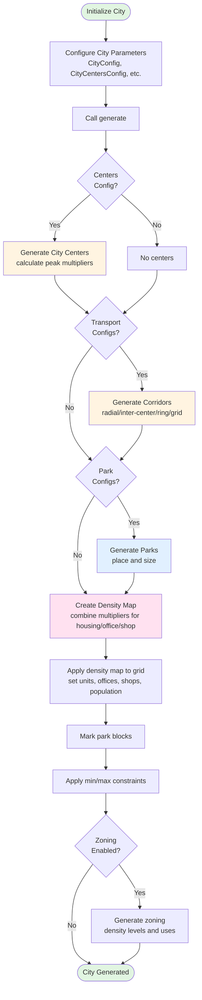

# City Simulation

This simulation generates realistic urban density patterns on a grid-based city model.

## Core Components

### Spatial Structure

The simulation uses a grid-based spatial model:

- **[Block](block.py)**: The fundamental unit representing a city block with population, housing units, offices, shops, and zoning
- **[Grid](grid.py)**: A container holding all blocks in a 2D coordinate system

### Generation (Functional)

City components are generated using pure functions in **[generation.py](generation.py)**:

- `generate_city_centers()`: Creates activity centers with density multipliers calculated from absolute densities
- `generate_transportation_corridors()`: Generates corridor blocks (radial, inter-center, ring, or grid patterns)
- `generate_parks()`: Places parks with configurable size and distribution

### Density Calculation (Multiplier-Based)

Density is calculated using a unified multiplier-based system in **[density.py](density.py)**:

- Base densities (housing, office, shop) are set in `CityConfig`
- City centers provide peak multipliers that decay exponentially with distance
- Transportation corridors provide multipliers for blocks along corridors
- Parks zero out density for all types
- Multipliers combine via additive, multiplicative, or max methods
- Final density = base_density × combined_multiplier

All three density types (housing, office, shop) use the same combination logic

### Zoning System

Zoning regulates allowed uses and density levels via **[zoning.py](zoning.py)**:

- Defines allowed uses (residential, office, commercial) and maximum density (low, medium, high) for each block
- Automatically zones areas near centers for mixed-use high-density development
- Zones remaining blocks based on their housing unit density
- Supports optional automatic upzoning based on neighboring blocks

### Parks

Parks create green space throughout the city:

- Configurable number, size, and placement strategy (random or dispersed)
- Can be square or circular shaped
- Zero out all density types (housing, offices, shops)
- Supports multiple park configurations

## Main Interface

The **[City](city.py)** class provides a unified interface that orchestrates all components:

1. Generates city components as objects (centers, corridors, parks)
2. Creates density map from all components using multiplier system
3. Applies density map to grid blocks
4. Applies city-wide density constraints (min/max)
5. Applies zoning rules
6. Returns generated grid

Configure the city using `CityConfig`, `CityCentersConfig`, `TransportationConfig`, `ParkConfig`, and `ZoningConfig`, then call `generate()` to create the simulation.

## Simulation Flow

The generation process follows a functional approach:

